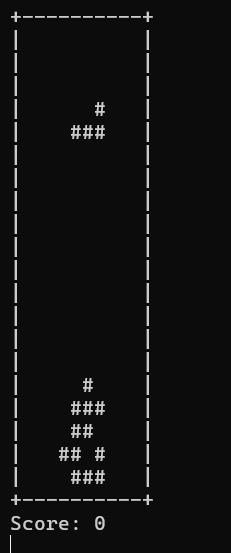

# 🎮 Console Tetris Game

A classic Tetris game written entirely in C++ for the command line interface. It features real-time input handling, tetromino rotation, increasing speed, score tracking, and simple ASCII graphics.

---

## 📖 Game Overview

This project recreates the core mechanics of Tetris, including:

- Falling tetromino blocks (T, L, S shapes)
- Piece movement: left, right, down
- Rotation
- Line clearing
- Increasing game speed over time
- Score tracking

It uses basic terminal rendering and keyboard input using `conio.h` and `windows.h` (Windows only).

---

## 🕹️ Controls

| Key | Action       |
|-----|--------------|
| `W` | Rotate       |
| `A` | Move Left    |
| `D` | Move Right   |
| `S` | Move Down    |

---

## ⚙️ Features

- 🧱 Basic tetromino support (T, L, S)
- 🕰️ Gradual speed increase as game progresses
- 🧠 Real-time input handling with `_kbhit()` and `_getch()`
- 📊 Score calculated based on lines cleared
- ❌ Game Over detection
- 🖥️ Full console rendering with borders and UI

---

## 🧪 Requirements

- **Platform:** Windows
- **Compiler:** C++ compiler with support for `conio.h` and `windows.h` (e.g., Code::Blocks with MinGW, Turbo C++, or MSVC)

---

## 💻 Source Code

All source code is included in the `code/` folder:

- [`tetris_game.cpp`](code/tetris_game.cpp)

---

## 📸 Demo

---

## 👤 Author

- [Aleeza Rizwan](https://github.com/its-aleezA)

---

## 🔖 License

This project is licensed under the MIT License.
See the [LICENSE](LICENSE) file for full details.
